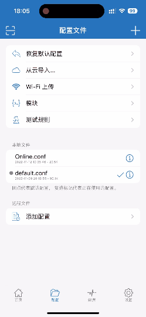

# GFWlist

根据 SSR GFWlist 生成的 shadowrocket 配置文件，用于IOS端。这和默认的配置文件有什么区别？这就需要知道什么是 PAC 了。

> PAC就是让代理软件通过PAC代理规则文件 进行上网流量分流，比如让国内IP、域名的流量直连，让国外的IP、域名通过SSR代理连接。

GFWlist.conf 是为了只让被墙域名使用代理，尽可能的避免使用代理，减少代理流量。

如果你不知道这几个文件是什么。那么你只需要知道 GFWlist.conf 怎么用。

## 怎么使用

你需要先复制这个URL：https://raw.githubusercontent.com/wildonchen/shadowrocket-GFWlist/main/GFWlist.conf

然后按照下图步骤操作即可。

